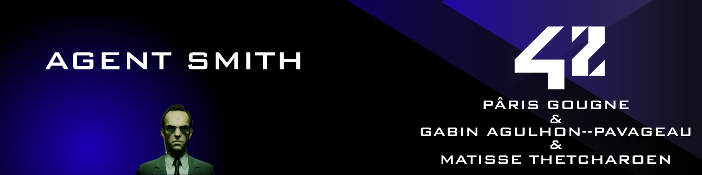
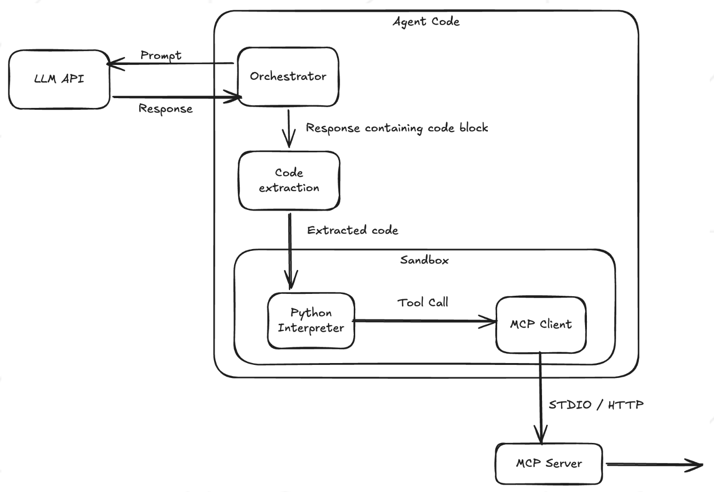

_This project has been created as part of the 42 curriculum by pgougne, gagulhon, mthetcha._ 

___
# Description
## Introduction

Software engineering is no longer only about writing correct code, it is about under-
standing systems, navigating large codebases, debugging failures, and iter-
ating efficiently. Modern LLMs generate code well, but fixing real bugs also needs
exploration, hypothesis testing, execution, and observation.\
This is where Agent Smith comes in. A Code Agent is not just a model that writes code:
it reasons about a task, interacts with tools, executes code safely, observes
results, and adapts its strategy. In this project, you will design and implement such
a system, moving beyond static prompts and JSON-based tool calling to build a fully
agentic loop driven by executable Python code.

## Project
This project involves creating two agents that interact within a sandbox by executing Python code to complete specific tasks.

    MBPP Agent: Focuses on standard coding tasks (Mostly Basic Python Problems) by writing functions to solve given problems.

    SWE-bench Agent: Focuses on software engineering tasks, such as diagnosing bugs and modifying existing codebases. This agent operates in a loop, allowing it to iteratively read, modify, and write files until the issue is resolved.

To let agents modify, create, write and read files, execute python code, we must isolate as much as possible to be protected against malicious code. For this, we created the sandbox to isolate the execution and the actions made by the agent on files are in a docker accessible by a mcp server with provided tools and an mcp client directly in the sandbox.

    Sandbox: The sandbox use the python function "exec" to create another executed code with restricted acces. It is restricted in many ways:
     - import restriction
     - builtin restriction
     - network block
     - path restrict
     - time limit
     - memory limit
     - MCP protocol

    McpServer: Mcp Server is a local server where the agent can use tools in to succeed the tasks.
___
# Instructions

This project use UV

To run the project, you must install all the dependencies
```sh
make install
```

And then:
```sh
make run
```

To check the type-hint
```sh
make lint
```

To check the type-hint with strict flag
```sh
make lint-strict
```

___
# Resources
https://www.iditect.com/faq/python/how-to-sandbox-python-in-pure-python.html
https://phase2online.com/insights/explain-it-like-i-m-five-what-the-heck-is-an-mcp-server

**How AI was used ?**\
Ai was used throughout this project as a support and learning assistant.

- Organising:
  - Split the project into multiple parts
  - Suggest an organisation plan

- Debugging:
  - Explain unexpected behaviors
  - Suggest potential causes of bugs

- Global Assistance:
  - Discuss best practices in project structure
  - Writing Docstrings

___
# System architecture

The architecture was dictate by the subject:

Here is an example of how the agent operates:

  - Task Processing: The agent takes the task generated by the moulinette and uses it to construct a prompt for the LLM.

  - Code Generation: The LLM responds with Python code aiming to solve the problem.

  - Sandboxed Execution: The agent extracts the code and runs it safely inside a sandbox.

  - Tool Access: If needed during execution, the sandbox calls external tools on the MCP server via the MCP client.

  - Evaluation Loop: The sandbox returns its output to the agent for evaluation:

    - If the solution fails or remains incomplete, the output is fed back into the loop to refine the code.

    - If all tests pass, the loop terminates successfully.

___
# Agent loop explanation

mthetcha


___
# Sandbox design

The Sandbox class is designed to securely execute code generated by the agent.

To achieve this, the class builds an execution environment with a restricted dictionary containing only whitelisted imports and built-in functions. The code is then executed inside an isolated child process for enhanced security. Within this process, two key functions are used: compile() to check for syntax and static errors, and exec() to run the code using the restricted dictionary as its global namespace.

Finally, the child process sends the execution results back to the main process via IPC (Inter-Process Communication), allowing the agent to interpret the response and either refine its code or confirm task completion.

___
# Tool implementation details

gagulhon


___
# Benchmark results and analysis

